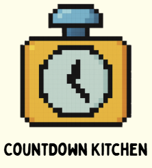

<<<<<<< HEAD

  

# 倒數計食 CountdownKitchen

一款結合提醒、分類與視覺化的 **食材管理 Android App**，協助使用者掌握冰箱庫存、減少食物浪費，實踐永續生活。

---
=======

  

    <h1>倒數計食 CountdownKitchen</h1>
    
一款結合提醒、分類與視覺化的 <strong>食材管理 Android App</strong>，協助使用者掌握冰箱庫存、減少食物浪費，實踐永續生活。

  

  

>>>>>>> 953d4c76a51bad21ab3082a0cb18079f6b147886

## 功能特色

| 類別 | 功能說明 |
|------|----------|
| 食品管理 | 食品新增、編輯、刪除（含掃描 QRCode 建立） |
| 快速查詢 | 可依名稱或分類搜尋、排序到期日優先 |
| 到期提醒 | 到期前推播通知（使用 Notification） |
| 視覺化統計 | 顯示每月使用／報廢比例，養成好習慣 |
| 廚餘統計 | 支援刪除時紀錄廚餘，回饋使用狀況 |

---

## 使用技術

- **Kotlin + Android Studio**
- **Room** 本地資料庫（食品資料）
- **MPAndroidChart** 圖表呈現視覺化結果
- **MVVM 架構設計**
- **通知推播機制（BroadcastReceiver）**
- **QRCode 掃描（ZXing 整合）**
<<<<<<< HEAD

---

## 專案結構
CountdownKitchen/
├── app/
│ ├── src/
│ │ └── main/
│ │ ├── java/com/example/countdownkitchen/
│ │ │ ├── ui/ # 所有 Activity 畫面邏輯
│ │ │ ├── adapter/ # RecyclerView Adapter
│ │ │ ├── data/ # Room 資料庫與模型
│ │ │ ├── helper/ # 工具與提醒模組
│ │ │ └── viewmodel/ # ViewModel（如有）
│ │ ├── res/
│ │ │ ├── layout/ # XML 畫面（已分類）
│ │ │ ├── drawable/ # icon 與背景圖
│ │ │ └── values/
│ │ └── AndroidManifest.xml
├── .gitignore
├── assets/
│   └── logo.png # 商品 LOGO 
├── README.md
├── build.gradle
└── docs/ # 團隊報告與甘特圖（非程式碼）

=======
>>>>>>> 953d4c76a51bad21ab3082a0cb18079f6b147886
---

## 團隊分工

| 組員 | 負責項目 |
|------|----------|
| **黃伃菉** | 主畫面流程設計、期末報告整合撰寫、進度追蹤表管理、簡報主持與彙整 |
| **洪宜萱** | 期中報告整合撰寫、簡報主持與彙整 |
| **黃曉嫻** | 食品過期提醒模組開發（推播機制、提醒設定）、系統通知整合 |
| **王宣筑** | 食品查詢與排序功能、分類介面設計、QRCode 掃描功能 |
| **林立婕** | 圖表視覺化模組、報廢記錄設計、資料庫與整合功能實作 |

---

## 開發時程（摘要）

| 任務階段 | 日期 |
|----------|------|
| 食品資料新增功能 | 2025/4/12 - 2025/4/21 |
| 到期提醒功能 | 2025/4/20 - 2025/4/27 |
| 搜尋與排序功能 | 2025/4/22 - 2025/4/28 |
| 視覺化統計模組整合 | 2025/4/25 - 2025/5/1 |
| 系統整合與測試 | 2025/5/2 - 2025/5/11 |

---

## 環保貢獻與永續理念

透過本 App，用戶可有效降低廚餘、提升食材使用效率，減少碳足跡，實踐聯合國永續目標（SDGs）中有關 **「負責任的消費與生產」**（ESG 12）之核心價值。

---

## 授權 License

本專案採用 MIT 授權條款，歡迎參考、修改與應用。
